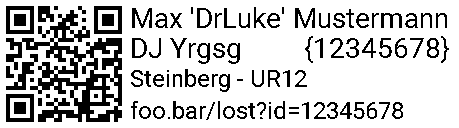

# inventorylabel
Generate Inventory Labels to print with a Brother P-Touch 2430

## Usage
Adjust your name, artist name and URLs manually in the code.

Then call the script like this:
`python inventorylabel.py ITEMID ITEMVENDOR ITEMNAME`
All arguments after `ITEMNAME` will be concatenated with a space.

For example, calling `python inventorylabel.py 12345678 Steinberg UR12` will generate the following label:

The resulting image `out.png` can then be directly used to print the label like this: `ptouch-print --image out.png`